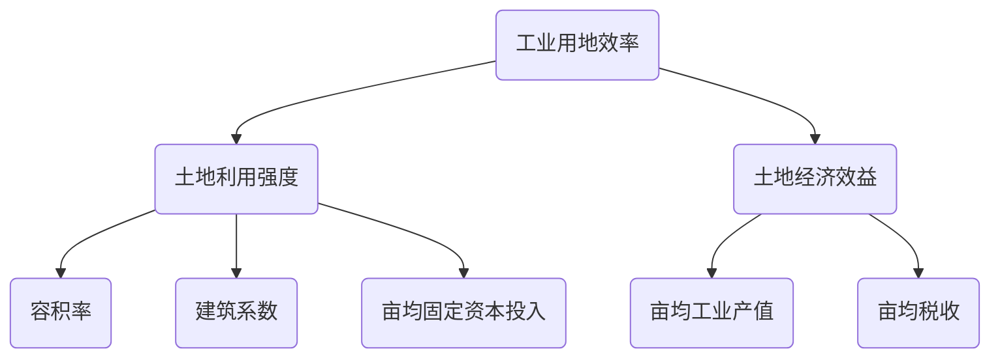
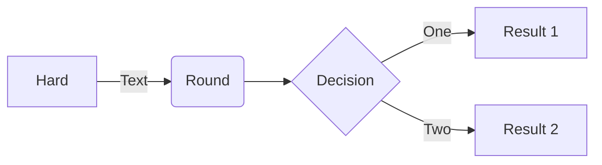
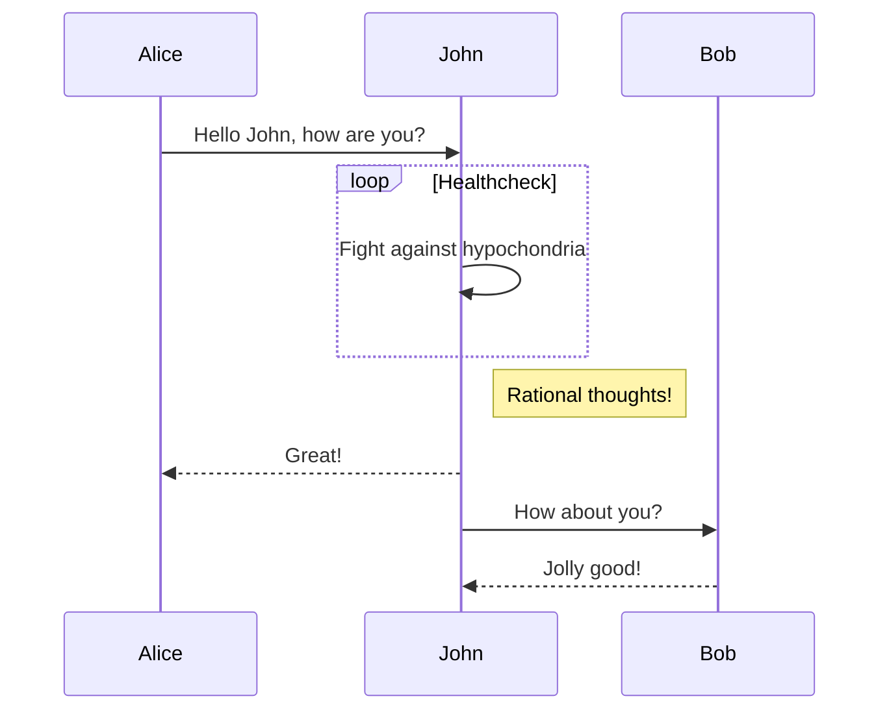
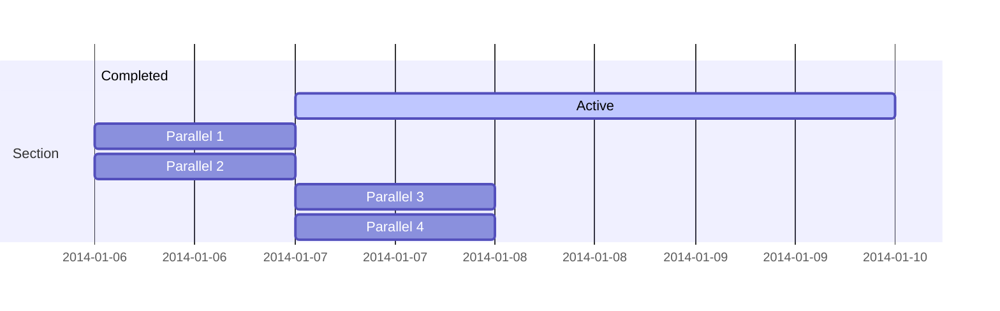
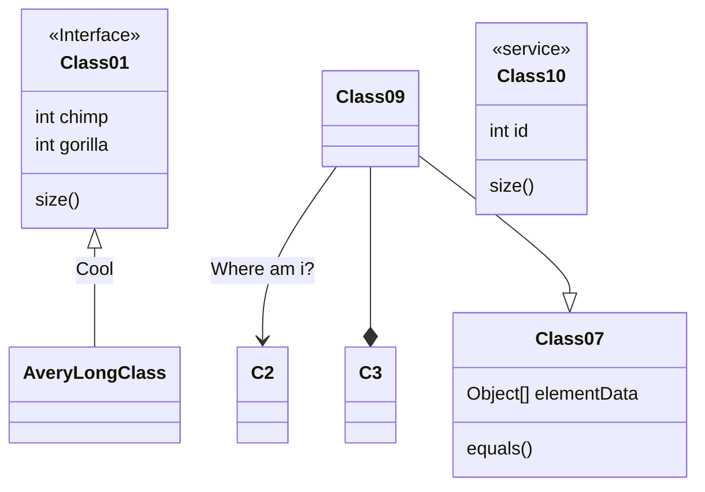
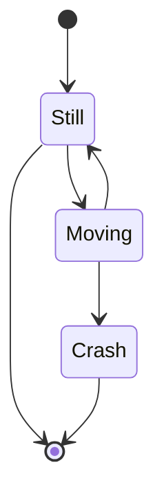
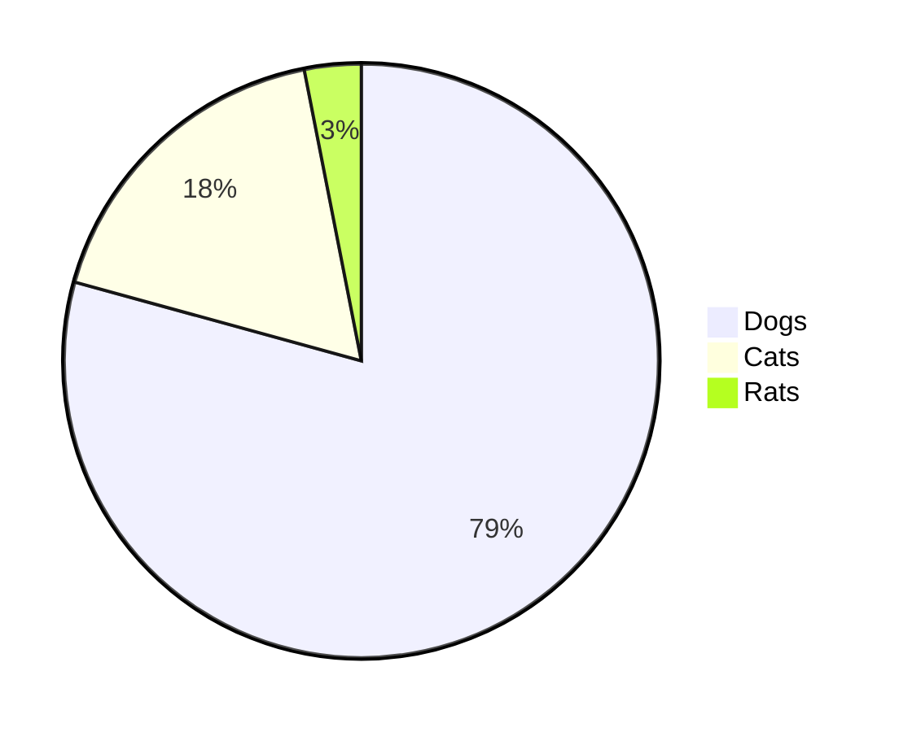
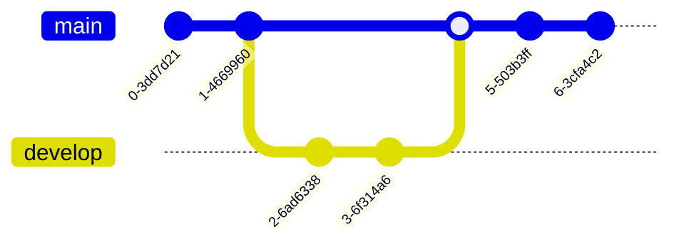
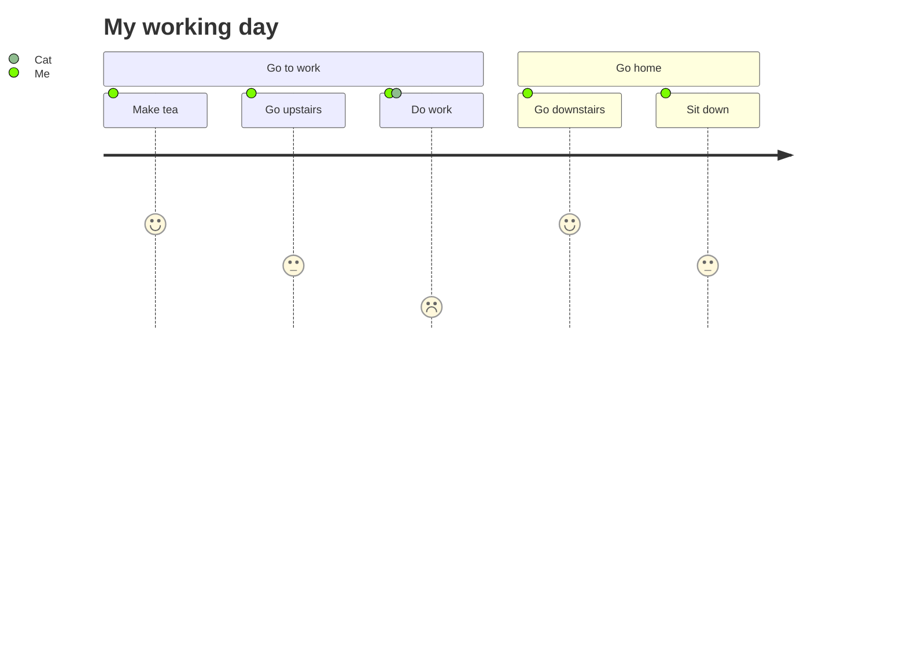
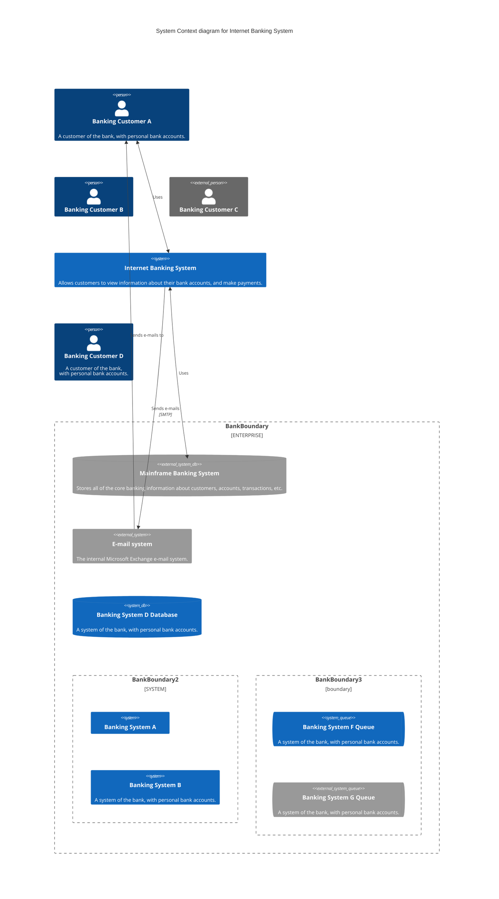

# mermaid使用示例

<!--ts-->
* [mermaid使用示例](#mermaid使用示例)
   * [介绍](#介绍)
   * [示例](#示例)
      * [思维导图](#思维导图)
      * [流程图](#流程图)
      * [时序图](#时序图)
      * [甘特图](#甘特图)
      * [类图](#类图)
      * [状态图](#状态图)
      * [饼图](#饼图)
      * [gitgraph(experimental in v9)](#gitgraphexperimental-in-v9)
      * [日记图](#日记图)
      * [C4架构图(experimental in v9)](#c4架构图experimental-in-v9)
   * [参考资源](#参考资源)

<!-- Created by https://github.com/ekalinin/github-markdown-toc -->
<!-- Added by: runner, at: Sat Jul 23 04:56:33 UTC 2022 -->

<!--te-->

## 介绍


```admonish info title='mermaid'
mermaid本身是一种mindmap+UML的语法, 其灵感来源于markdown语法的渲染机制。
```

## 示例
### 思维导图
默认不支持，虽然Mermaid本身暂未支持思维导图的绘制，但是考虑到Mermaid对流程图的支持，可以用Mermaid绘制极简单的思维导图



### 流程图



### 时序图



### 甘特图



### 类图



### 状态图



### 饼图



### gitgraph(experimental in v9)



### 日记图



### C4架构图(experimental in v9)



## 参考资源

- [mermaid-js/mermaid: Generation of diagram and flowchart from text in a similar manner as markdown](https://github.com/mermaid-js/mermaid)
- [mermaid - Markdownish syntax for generating flowcharts, sequence diagrams, class diagrams, gantt charts and git graphs.](https://mermaid-js.github.io/mermaid/#/)
- [Online FlowChart & Diagrams Editor - Mermaid Live Editor](https://mermaid.live/edit#pako:eNpNkE9rwzAMxb-K8WmDtlmSLW1zGKx_YIfBoOutyUG1lcQssYsjrytJvvuclsJ0Eu_3npDUcWEk8pQXtTmLCiyxj12mma-3wztYmbPp9LXf4y_1bPWwM07LxxtfjYStuw0K1Sqjh5u8vgY-NfZsc9hh62piYf6f7c-mZ9s7i3I-4Q3aBpT0e3SjM-NUYYMZT30rwX5nPNOD97mTBMKtVGQsTwuoW5xwcGS-LlrwlKzDu2mjoLTQ3MXagESf6ThdTuPBpWrJTxRGF6ocdWdrL1dEpzYNghHPSkWVO86EaYJWyfE71c8yCZIoWUAUYzKP4SWOpTiGy0URPYeFnD-FEfBhGP4AHgtu4w)
- OS Awards 2019 得奖 🏆 : [JavaScript Open Source Awards - GitNation](https://osawards.com/javascript/2019)
- [mermaid - Markdownish syntax for generating flowcharts, sequence diagrams, class diagrams, gantt charts and git graphs.](https://mermaid-js.github.io/mermaid/#/./integrations)
- gitgraph从v9.0.0开始被支持：[Releases · mermaid-js/mermaid](https://github.com/mermaid-js/mermaid/releases)
  > 此处是源码
- 编译好的js文件下载：
  > [mermaid CDN by jsDelivr - A CDN for npm and GitHub](https://www.jsdelivr.com/package/npm/mermaid?path=dist)

```admonish tip title='mdbook 更新mermaid版本'
1. 下载好对应版本的mermaid.min.js文件
2. 替换book.toml中对应的additional-js中的mermaid.min.js文件
3. 注意要多刷新两次才能更新缓存
```