# PlantUML

<!--ts-->

* [PlantUML](#plantuml)
    * [示例](#示例)
        * [思维导图](#思维导图)
            * [OrgMode 语法](#orgmode-语法)
            * [Markdown语法](#markdown语法)
            * [运算符决定方向](#运算符决定方向)
            * [多行表示](#多行表示)
            * [多根节点](#多根节点)
            * [改变节点颜色](#改变节点颜色)
            * [移除方框](#移除方框)
            * [指定左右方向](#指定左右方向)
            * [带标签的完整示例](#带标签的完整示例)
            * [应用：rust的模块系统整理](#应用rust的模块系统整理)
    * [使用<strong>skinparam</strong>进行样式设置](#使用skinparam进行样式设置)
        * [颜色](#颜色)
        * [字体与大小](#字体与大小)
        * [文本对齐](#文本对齐)
        * [手写体](#手写体)
        * [下面罗列当前版本plantuml可用样式](#下面罗列当前版本plantuml可用样式)
    * [参考资源](#参考资源)
        * [小插曲一：给mdbook-puml安装合适的plantuml](#小插曲一给mdbook-puml安装合适的plantuml)
        * [小插曲二：plantuml中文字体设置](#小插曲二plantuml中文字体设置)

<!-- Created by https://github.com/ekalinin/github-markdown-toc -->
<!-- Added by: kuanhsiaokuo, at: Sat Jul  9 22:11:42 CST 2022 -->

<!--te-->

## 示例

### 添加超链接、提示、标签


#### 超链接

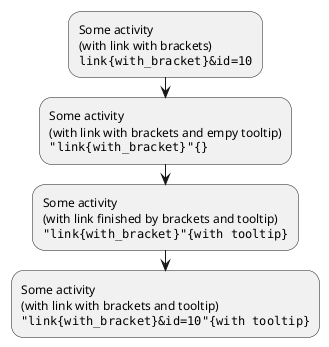

### 思维导图

#### OrgMode 语法

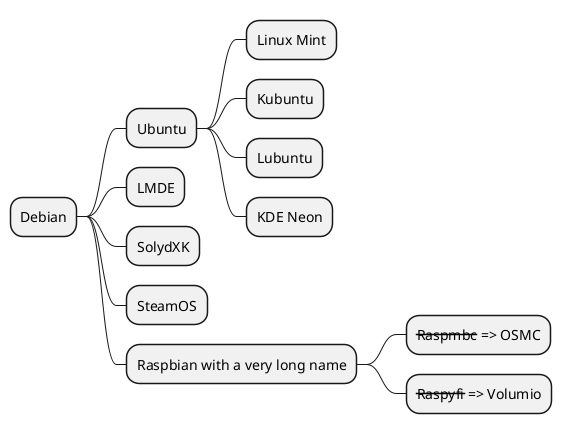

#### Markdown语法

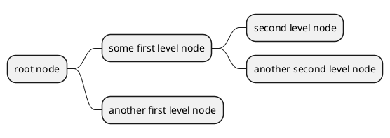

#### 运算符决定方向

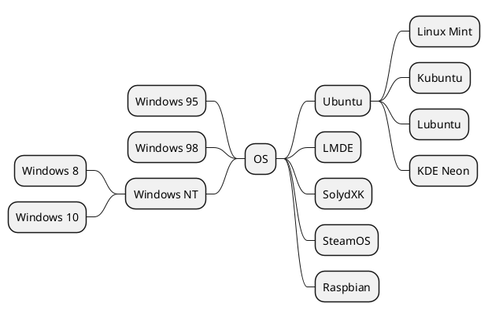

#### 多行表示

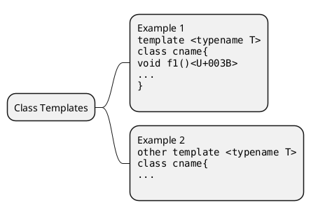

#### 多根节点

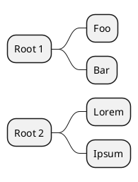

#### 改变节点颜色

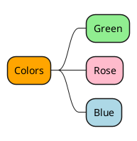

#### 移除方框


#### 指定左右方向

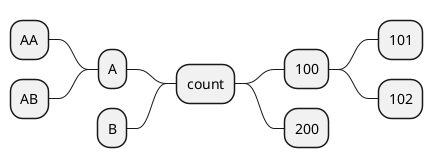

#### 带标签的完整示例

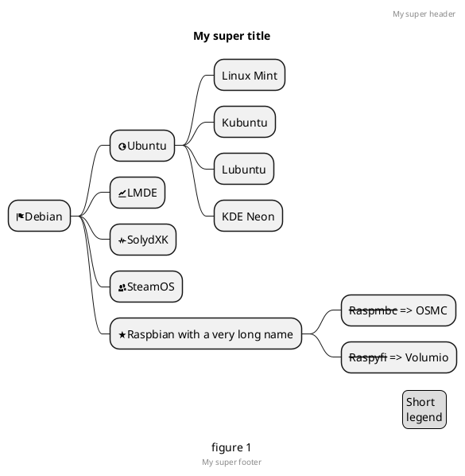

#### 应用：rust的模块系统整理

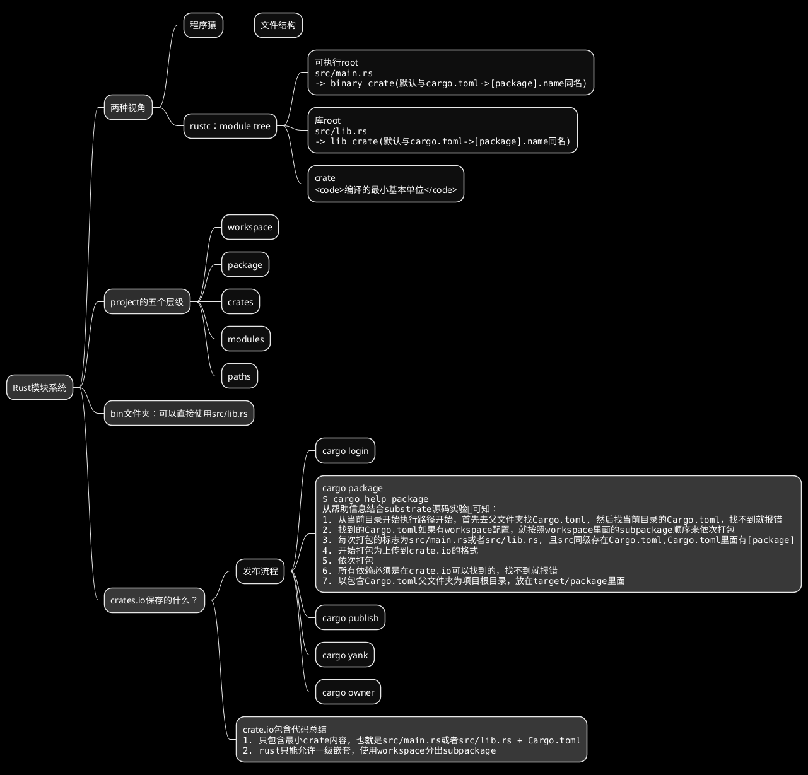

## 使用**skinparam**进行样式设置

### 颜色

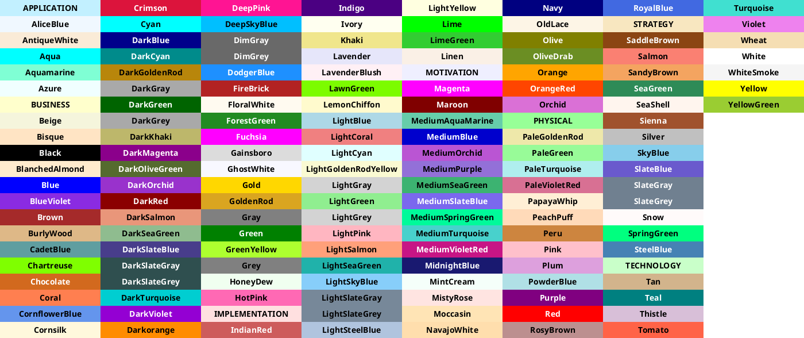

### 字体与大小

```admonish tip title='查看系统支持的字体'
plantuml -language
```

- skinparam classFontColor red
- skinparam classFontSize 10
- skinparam classFontName Aapex

```admonish warning title='考虑可移植性'
请注意：字体名称高度依赖于操作系统，因此不要过度使用它， 当你考虑到可移植性时。 Helvetica and Courier 应该是全平台可用。
```

### 文本对齐

- skinparam sequenceMessageAlign center/right/left

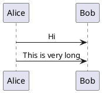

### 手写体

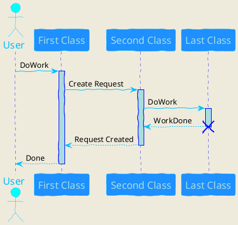

### 下面罗列当前版本plantuml可用样式

```plantuml
@startuml
help skinparams
@enduml
```

## 参考资源

- [开源工具，使用简单的文字描述画UML图。](https://plantuml.com/zh/)
    - [Using Hyperlinks](https://plantuml.com/zh/link)
    - [MindMap syntax and features](https://plantuml.com/zh/mindmap-diagram)
- 在线服务：[PlantUML Web Server](https://www.plantuml.com/plantuml/uml/SyfFKj2rKt3CoKnELR1Io4ZDoSa70000)
- ~~本来选用这个crate, 但是安装太麻烦：~~
    - [sytsereitsma/mdbook-plantuml: mdBook preprocessor to render PlantUML diagrams to png images in the book output directory](https://github.com/sytsereitsma/mdbook-plantuml)
    - [mdbook-plantuml - crates.io: Rust Package Registry](https://crates.io/crates/mdbook-plantuml)
- 选用这个mdbook插件：
  > [hamaluik/mdbook-puml: A simple mdbook preprocessor for rendering inline PlantUML code blocks into inline SVG](https://github.com/hamaluik/mdbook-puml)
    - [mdbook-puml - crates.io: Rust Package Registry](https://crates.io/crates/mdbook-puml)

```admonish quote title='why create mdbook-puml'
I created this preprocessor because mdbook-plantuml wasn't working for me—specifically, mdbook-plantuml is currently incompatible with mdbook watch and mbbook serve because it triggers a rebuild loop.

This crate is quite simple and non-customizable at this point as it does all that I need it to for my own purposes. Feel free to fork and/or PR away though, and I'll be happy to include changes.
```

### 小插曲一：给mdbook-puml安装合适的plantuml

1. plantuml是基于graphviz的一个工具， Graphviz 是一个开源的图可视化工具，非常适合绘制结构化的图标和网络。它使用一种叫 DOT 的语言来表示图形。

> [官网](https://graphviz.gitlab.io/download/)可以看到，官方不再提供编译好的各个平台版本，现在都是第三方编译好保存的。这也难怪ubuntu的版本那么低。

2. plantuml的uml图生成需要的graphviz版本较低
3. plantuml新出的非uml图，比如思维导图，需要较新的plantuml才能支持

4. osx的brew可以安装3.0版本graphviz，plantuml的版本也比较新，支持思维导图渲染

- plantuml版本：1.2022.4, graphviz版本：3.0.0

```shell
brew install plantuml                                                                                                                            ─╯
Warning: plantuml 1.2022.4 is already installed and up-to-date.
To reinstall 1.2022.4, run:
  brew reinstall plantuml

brew install graphviz                                                                                                                            ─╯
Warning: graphviz 3.0.0 is already installed and up-to-date.
To reinstall 3.0.0, run:
  brew reinstall graphviz

```

5. ubuntu的apt只能安装2.x版本graphviz，这个没关系，但是plantuml是2017年的，不支持思维导图渲染

```
成功：plantuml test_uml 
失败： plantuml test_mindmap
```

> plantuml版本过老：1.2017.15-1

```shell
sudo apt-get install plantuml
[work] 0:vim- 1:bash*Z                                                                                                 "ip-172-26-8-185" 13:22 09-Jul-22
Reading package lists... Done
Building dependency tree
Reading state information... Done
plantuml is already the newest version (1:1.2017.15-1).
The following package was automatically installed and is no longer required:
  linux-aws-5.4-headers-5.4.0-1075
Use 'sudo apt autoremove' to remove it.
0 upgraded, 0 newly installed, 0 to remove and 123 not upgraded
```

> 目前apt-get安装的graphviz为2.40.1-2

``` shell
sudo apt-get install graphviz
Reading package lists... Done
Building dependency tree
Reading state information... Done
The following package was automatically installed and is no longer required:
  linux-aws-5.4-headers-5.4.0-1075
Use 'sudo apt autoremove' to remove it.
Suggested packages:
  gsfonts graphviz-doc
The following NEW packages will be installed:
  graphviz
0 upgraded, 1 newly installed, 0 to remove and 123 not upgraded.
Need to get 0 B/601 kB of archives.
After this operation, 3076 kB of additional disk space will be used.
Selecting previously unselected package graphviz.
(Reading database ... 142532 files and directories currently installed.)
Preparing to unpack .../graphviz_2.40.1-2_amd64.deb ...
Unpacking graphviz (2.40.1-2) ...
Setting up graphviz (2.40.1-2) ...
Processing triggers for man-db (2.8.3-2) ...
```

6. 最后找到一个专门下载安装最新版本plantuml的脚本，才成功安装

- [metanorma/plantuml-install: Installation script for PlantUML](https://github.com/metanorma/plantuml-install)

> 我把这个脚本放在.github/workflows里面。

### 小插曲二：plantuml中文字体设置
