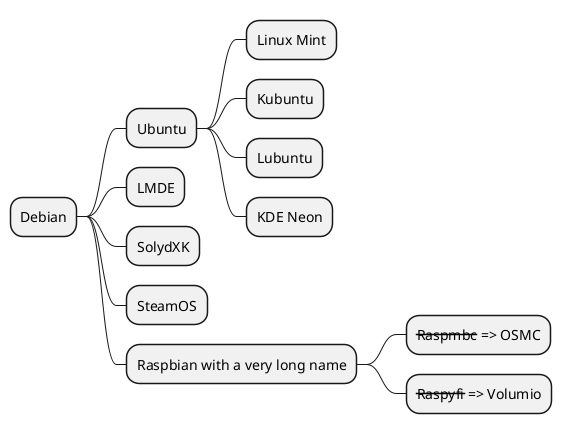
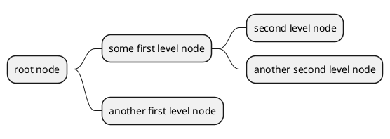
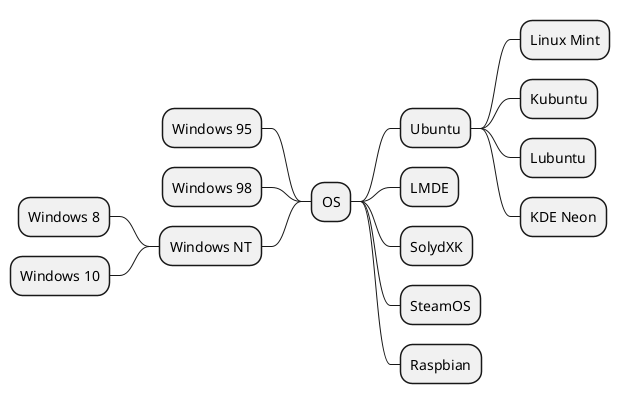
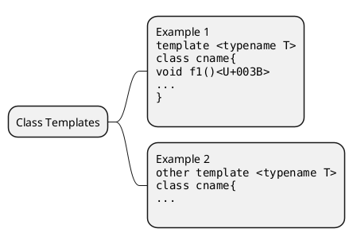
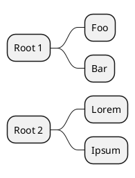
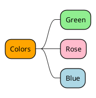
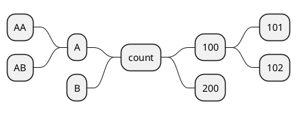
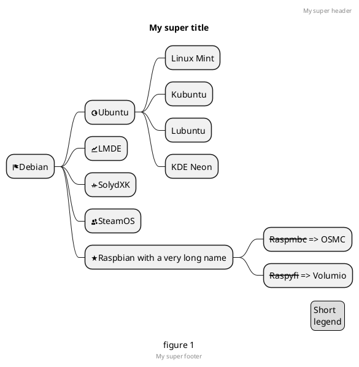

# PlantUML

<!--ts-->
<!--te-->

## 示例

### 思维导图

#### OrgMode 语法



#### Markdown语法



#### 运算符决定方向



#### 多行表示


#### 多根节点

#### 改变节点颜色

#### 移除方框


#### 指定左右方向


#### 带标签的完整示例


## 参考资源

- [开源工具，使用简单的文字描述画UML图。](https://plantuml.com/zh/)
    - [MindMap syntax and features](https://plantuml.com/zh/mindmap-diagram)
- 在线服务：[PlantUML Web Server](https://www.plantuml.com/plantuml/uml/SyfFKj2rKt3CoKnELR1Io4ZDoSa70000)
- ~~本来选用这个crate, 但是安装太麻烦：~~
    - [sytsereitsma/mdbook-plantuml: mdBook preprocessor to render PlantUML diagrams to png images in the book output directory](https://github.com/sytsereitsma/mdbook-plantuml)
    - [mdbook-plantuml - crates.io: Rust Package Registry](https://crates.io/crates/mdbook-plantuml)
- 选用这个mdbook插件：
  > [hamaluik/mdbook-puml: A simple mdbook preprocessor for rendering inline PlantUML code blocks into inline SVG](https://github.com/hamaluik/mdbook-puml)

```admonish quote title='why create mdbook-puml'
I created this preprocessor because mdbook-plantuml wasn't working for me—specifically, mdbook-plantuml is currently incompatible with mdbook watch and mbbook serve because it triggers a rebuild loop.

This crate is quite simple and non-customizable at this point as it does all that I need it to for my own purposes. Feel free to fork and/or PR away though, and I'll be happy to include changes.
```