# PlantUML

<!--ts-->

* [PlantUML](#plantuml)
    * [示例](#示例)
        * [思维导图](#思维导图)
            * [OrgMode 语法](#orgmode-语法)
            * [Markdown语法](#markdown语法)
            * [运算符决定方向](#运算符决定方向)
            * [多行表示](#多行表示)
            * [多根节点](#多根节点)
            * [改变节点颜色](#改变节点颜色)
            * [移除方框](#移除方框)
            * [指定左右方向](#指定左右方向)
            * [带标签的完整示例](#带标签的完整示例)
    * [参考资源](#参考资源)

<!-- Created by https://github.com/ekalinin/github-markdown-toc -->
<!-- Added by: kuanhsiaokuo, at: Fri Jul  8 23:51:52 CST 2022 -->

<!--te-->

## 示例

### 思维导图

#### OrgMode 语法


#### Markdown语法


#### 运算符决定方向


#### 多行表示


#### 多根节点


#### 改变节点颜色


#### 移除方框


#### 指定左右方向


#### 带标签的完整示例


#### 应用：rust的模块系统整理

```plantuml
@startmindmap
*[#lightblue] Rust模块系统
**[#FFBBCC] 两种视角
*** 程序猿
**** 文件结构
*** rustc：module tree
****:可执行root
<code>
src/main.rs 
-> binary crate(默认与cargo.toml->[package].name同名)
</code>;
****:库root
<code>
src/lib.rs 
-> lib crate(默认与cargo.toml->[package].name同名)
</code>;
****:crate
<code>编译的最小基本单位</code>;
**[#FFBBCC] project的五个层级
*** workspace
*** package
*** crates
*** modules
*** paths
**[#FFBBCC] bin文件夹：可以直接使用src/lib.rs
**[#lightgreen] crates.io保存的什么？
*** 发布流程
**** cargo login
****[#lightgreen]:cargo package
<code>
$ cargo help package
从帮助信息结合substrate源码实验🧪可知：
1. 从当前目录开始执行路径开始，首先去父文件夹找Cargo.toml, 然后找当前目录的Cargo.toml，找不到就报错
2. 找到的Cargo.toml如果有workspace配置，就按照workspace里面的subpackage顺序来依次打包
3. 每次打包的标志为src/main.rs或者src/lib.rs, 且src同级存在Cargo.toml,Cargo.toml里面有[package]
4. 开始打包为上传到crate.io的格式
5. 依次打包
6. 所有依赖必须是在crate.io可以找到的，找不到就报错
7. 以包含Cargo.toml父文件夹为项目根目录，放在target/package里面
</code>;
**** cargo publish
**** cargo yank
**** cargo owner
***[#lightgreen]:crate.io包含代码总结
<code>
1. 只包含最小crate内容，也就是src/main.rs或者src/lib.rs + Cargo.toml
2. rust只能允许一级嵌套，使用workspace分出subpackage
</code>;
@endmindmap
```



## 参考资源

- [开源工具，使用简单的文字描述画UML图。](https://plantuml.com/zh/)
    - [MindMap syntax and features](https://plantuml.com/zh/mindmap-diagram)
- 在线服务：[PlantUML Web Server](https://www.plantuml.com/plantuml/uml/SyfFKj2rKt3CoKnELR1Io4ZDoSa70000)
- ~~本来选用这个crate, 但是安装太麻烦：~~
    - [sytsereitsma/mdbook-plantuml: mdBook preprocessor to render PlantUML diagrams to png images in the book output directory](https://github.com/sytsereitsma/mdbook-plantuml)
    - [mdbook-plantuml - crates.io: Rust Package Registry](https://crates.io/crates/mdbook-plantuml)
- 选用这个mdbook插件：
  > [hamaluik/mdbook-puml: A simple mdbook preprocessor for rendering inline PlantUML code blocks into inline SVG](https://github.com/hamaluik/mdbook-puml)
    - [mdbook-puml - crates.io: Rust Package Registry](https://crates.io/crates/mdbook-puml)

```admonish quote title='why create mdbook-puml'
I created this preprocessor because mdbook-plantuml wasn't working for me—specifically, mdbook-plantuml is currently incompatible with mdbook watch and mbbook serve because it triggers a rebuild loop.

This crate is quite simple and non-customizable at this point as it does all that I need it to for my own purposes. Feel free to fork and/or PR away though, and I'll be happy to include changes.
```